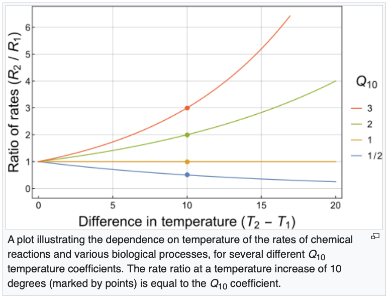

Welcome to the TEMPEST Flood Tree Greenhouse Gas Flux dataset analysis!

```{r setup, include=FALSE}
knitr::opts_chunk$set(echo = TRUE)

library(ggplot2)
theme_set(theme_bw())
library(dplyr)
library(lubridate)
library(compasstools)
library(arrow)
library(broom)
library(patchwork)
```

# Setup

## TEMPEST flood dates
```{r flood-dates}
flood_date <- tribble(~Event, ~Start, ~End,
                      "T1", "2022-06-22", "2022-06-22",
                      "T2", "2023-06-06", "2023-06-07",
                      "T3", "2024-06-11", "2024-06-13")
flood_date$Start <- ymd(flood_date$Start)
flood_date$End <- ymd(flood_date$End)

knitr::kable(flood_date)
```

## Read data
```{r read-data}
# Read in data from Apache Parquet file -----
FLUX_DATA_FILE <- "tempest_tree_ghg_fluxes.parquet"
message("Reading ", FLUX_DATA_FILE)
my_data <- read_parquet(FLUX_DATA_FILE)

code_to_name <- c(ACRU = "Red Maple", FAGR = "Beech", LITU = "Tulip Poplar")

TREE_MAPPING_FILE <- "ancillary_data/sapflow_tree_mapping.csv"
message("Reading ", TREE_MAPPING_FILE)
tree_map <- read.csv(TREE_MAPPING_FILE,
                     stringsAsFactors = FALSE) %>%
  mutate(across(where(is.character), trimws)) %>%
  transmute(ID = Sapflux_ID,
            Species_from_map = unname(code_to_name[Species_Code])) %>%
  distinct(ID, .keep_all = TRUE)

my_data <- my_data %>%
  left_join(tree_map, by = "ID") %>%
  mutate(Species = coalesce(Species, Species_from_map)) %>%
  select(-Species_from_map)

message("Trees with NA species: ", sum(is.na(my_data$Species)))
```

## Prep Soil Temp Data
```{r}
soil_temp_data <- read_L2_variable(variable = "soil-temp-5cm",
                                   path = "Sensor_Data/", 
                                   quiet = TRUE)
soil_temp_daily <- soil_temp_data %>%
  mutate(
#    TIMESTAMP = as.POSIXct(TIMESTAMP),
    Date = as.Date(TIMESTAMP),
    Value = as.numeric(Value) ) %>%
  filter(!is.na(Value)) %>%  
  group_by(Site, Plot, Date) %>%
  summarise(
    soil_temp_daily_mean = mean(Value),
    n = n(),
    coverage = n / 96,      
    .groups = "drop"  )
print(soil_temp_daily)
# 96 is the number of recordings per day (24 hours/day × 60 minutes/hour = 1440 minutes/day, 1440 ÷ 15 = 96 measurements/day)
```

## Graphs of Soil Temp Data (Daily averages over time)
```{r}
ggplot(soil_temp_daily,
       aes(x = Date, y = soil_temp_daily_mean,
           color = Plot, group = Plot)) + 
  geom_line(alpha = 0.7) + 
  facet_wrap(~ Site) +
  labs( title = "Daily Mean Soil Temperature by Plot",
        x = "Date",
        y = "Soil Temperature (°C)" ) 
```

## Matching the plot names from tree flux and soil temp
```{r}
soil_temp_daily <- soil_temp_daily %>%
  mutate( Plot = recode(Plot,
         "C" = "Control",
         "F" = "Freshwater",
         "S" = "Seawater" )  )
```

## Joining datasets
```{r}
my_data <- my_data %>%
  left_join(
     soil_temp_daily %>%
    select(Plot, Date, soil_temp_daily_mean),
    by = c("Plot", "Date")) 
```

## Numerical summaries -----
```{r numerical-summaries}
print(my_data)
# BBL: print summary of fluxes? A table with mean, min, max and date ranges
```

This is the largest, or one of the largest, datasets ever assembled for 
tree stem fluxes: `r nrow(my_data)` observations for CO2 and CH4.

# Initial visualizations of Raw Data

## Boxplots
```{r}
summary(my_data$CH4_lin_flux.estimate)

my_data %>%
  ggplot(aes(x = factor(Year),
             y = CH4_lin_flux.estimate,
             fill = factor(Year))) +
  geom_boxplot(alpha = 0.7) +
  facet_grid(Species ~ .) +
  labs( title = "CH4 Flux by Species (2021–2025)",
    x = "Year",
    y = "CH4 Flux",
    fill = "Year") +
  theme(legend.position = "right")
```
Note that most trees exhibit CH4 emissions, but uptake does occur
in `sum(my_data$CH4_lin_flux.estimate < 0)` of the observations.

```{r}
summary(my_data$CO2_lin_flux.estimate)

my_data %>%
  ggplot(aes(x = factor(Year),
             y = CO2_lin_flux.estimate,
             fill = factor(Year))) +
  geom_boxplot(alpha = 0.7) +
  facet_grid(Species ~ .) +
  labs( title = "CO2 Flux by Species (2021–2025)",
    x = "Year",
    y = "CO2 Flux",
    fill = "Year") +
  theme(legend.position = "right")
```

## Overall flux range 

(using boxplot) for each gas, by tree species and plot

```{r flux-ranges}
ggplot(my_data,
       aes(x = Species, y = CH4_lin_flux.estimate, fill = Plot)) +
  geom_boxplot() +
  theme_bw() +
  theme(axis.text.x = element_text(angle = 45, hjust = 1))

ggplot(my_data, 
       aes(x = Species,  y = CO2_lin_flux.estimate, fill = Plot)) +
  geom_boxplot() +
  theme_bw() +
  theme(axis.text.x = element_text(angle = 45, hjust = 1))
```

## Spaghetti plots
```{r}
ggplot(my_data, aes(x = Date, y = CH4_lin_flux.estimate,
                    group = ID, color = Plot)) +
  geom_line(alpha = 0.2) +
  facet_wrap(~ Species) +
  labs(title = "CH4 Flux Over Time by Species and Plot",
       x = "Date",
       y = "CH4 Flux")

ggplot(my_data, aes(x = Date,
                    y = CO2_lin_flux.estimate,
                    group = ID,
                    color = Plot)) +
  geom_line(alpha = 0.2) +
  facet_wrap(~ Species) +
  labs(
    title = "CO2 Flux Over Time by Species and Plot",
    x = "Date",
    y = "CO2 Flux" )
```

## Heat Maps
```{r}
heat_data_CH4 <- my_data %>%
  group_by(Species, Year) %>%
  summarize(
    mean_flux = mean(CH4_lin_flux.estimate, na.rm = TRUE),
    .groups = "drop" )
ggplot(heat_data_CH4, aes(x = Year, y = Species, fill = mean_flux)) +
  geom_tile() +
  scale_fill_viridis_c() +
  labs( title = "Mean CH4 Flux by Species and Year", x = "Year", y = "Species",
        fill = "Mean CH4 Flux") + theme_minimal()
seawater_rows <- my_data %>%
  filter(Plot == "Seawater")

heat_data_CO2 <- my_data %>%
  group_by(Species, Year) %>%
  summarize(mean_flux = mean(CO2_lin_flux.estimate, na.rm = TRUE),.groups = "drop")
ggplot(heat_data_CO2,aes(x = Year, y = Species, fill = mean_flux)) +
  geom_tile() +
  scale_fill_viridis_c() +
  labs(title = "Mean CO2 Flux by Species and Year", x = "Year",y = "Species",
       fill = "Mean CO2 Flux" ) +theme_minimal()
```

## Relationship Between CH₄ and CO₂ Flux by Species
```{r}
ggplot(my_data, aes(x = CO2_lin_flux.estimate, y = CH4_lin_flux.estimate, color = Species)) +
  geom_point(alpha = 0.4) +
  geom_smooth(method = "lm", se = FALSE) +
  labs(title = "Relationship Between CO2 and CH4 Flux by Species", 
       x = "CO2 Flux", y = "CH4 Flux",
       color = "Species") +
  theme_minimal()
```

# Quarterly data

Summarizing by quarter provides a nice way to look at seasonal trends without
the inconsistency of the date-specific data.

## Creation of Quarters
```{r}
my_data <- my_data %>%
  mutate(
    Date = as.Date(Date),
    Year = year(Date),
    Quarter = quarter(Date),
    YearQuarter = Year + (Quarter-1)/4)

table(my_data$Quarter)

quarterly_CH4 <- my_data %>%
  mutate(is_S7 = ID == "S7") %>%
  group_by(YearQuarter, Species, Plot, is_S7) %>%
  summarize(mean_flux = mean(CH4_lin_flux.estimate, na.rm = TRUE),
            se = sd(CH4_lin_flux.estimate, na.rm = TRUE) / sqrt(n()), .groups = "drop")

quarterly_CO2 <- my_data %>%
  mutate(is_S7 = ID == "S7") %>%
  group_by(YearQuarter, Species, Plot, is_S7) %>%
  summarize(mean_flux = mean(CO2_lin_flux.estimate, na.rm = TRUE),
            se = sd(CO2_lin_flux.estimate, na.rm = TRUE) / sqrt(n()), .groups = "drop")
```

## Flood-week averages for reference
```{r}
flood_data <- list()
for(i in seq_len(nrow(flood_date))) {
  message("Isolating data for ", flood_date$Event[i])
  flood_data[[i]] <-
    my_data %>%
    filter(
      Date >= flood_date$Start[i],
      Date <= flood_date$End[i]  ) %>%
    mutate(Event = flood_date$Event[i])}
```
```{r}
flood_CH4 <- bind_rows(flood_data) %>%
  mutate(is_S7 = ID == "S7") %>%
  group_by(Event, YearQuarter, Species, Plot, is_S7) %>%
  summarize(
    mean_flux = mean(CH4_lin_flux.estimate, na.rm = TRUE),
    se = sd(CH4_lin_flux.estimate, na.rm = TRUE) / sqrt(n()),
    .groups = "drop" )

flood_CO2 <- bind_rows(flood_data) %>%
  mutate(is_S7 = ID == "S7") %>%
  group_by(Event, YearQuarter, Species, Plot, is_S7) %>%
  summarize(
    mean_flux = mean(CO2_lin_flux.estimate, na.rm = TRUE),
    se = sd(CO2_lin_flux.estimate, na.rm = TRUE) / sqrt(n()),
    .groups = "drop" )
```

## Quarterly Flux for both GHG (raw data)
```{r}
annual_means_CH4 <- my_data %>%
  group_by(Year, Species, Plot) %>%
  summarize( mean_flux = mean(CH4_lin_flux.estimate, na.rm = TRUE),
             se = sd(CH4_lin_flux.estimate, na.rm = TRUE) / sqrt(n()), .groups = "drop")
ggplot(annual_means_CH4, aes( x = Year, y = mean_flux,color = Plot,group = Plot)) +
  geom_line() +
  geom_point(size = 2) +
  geom_errorbar( aes(  ymin = mean_flux - se,ymax = mean_flux + se  ),width = 0.1 ) +
  facet_wrap(~ Species) +
  labs( title = "Mean CH4 Flux by Species and Plot (2021–2025)",
        x = "Year", y = "Mean CH4 Flux" ) 

annual_means_CO2 <- my_data %>%
  group_by(Year, Species, Plot) %>%
  summarize( mean_flux = mean(CO2_lin_flux.estimate, na.rm = TRUE),
             se = sd(CO2_lin_flux.estimate, na.rm = TRUE) / sqrt(n()), .groups = "drop")
ggplot(annual_means_CO2,aes( x = Year, y = mean_flux, color = Plot, group = Plot  )) +
  geom_line() +
  geom_point(size = 2) +
  geom_errorbar( aes(ymin = mean_flux - se,ymax = mean_flux + se ), width = 0.1) +
  facet_wrap(~ Species) +
  labs( title = "Mean CO2 Flux by Species and Plot (2021–2025)",
        x = "Year",
        y = "Mean CO2 Flux" ) 
```

## Quarterly Carbon Dioxide Flux with flood averages emphasized
```{r}
ggplot(quarterly_CO2,
       aes(x = YearQuarter, y = mean_flux, color = Plot, group = Plot)) +
  geom_line() +
  geom_point(size = 2) +
  geom_errorbar(
    aes(ymin = mean_flux - se,
        ymax = mean_flux + se),
    width = 0.05) +
  # Flood overlay (T1, T2, T3 labeled in legend)
  geom_point(
    data = flood_CO2,
    aes(x = YearQuarter,
        y = mean_flux,
        shape = Event),
    color = "black",
    size = 1.5,
    inherit.aes = FALSE) +
  facet_wrap(~ Species) +
  labs( title = "Quarterly CO2 Flux with Flood Events Highlighted",
        x = "Year-Quarter",
        y = "CO2 Flux",
        shape = "Flood event") +
  scale_shape_manual(values = c(
    T1 = 17,
    T2 = 17,
    T3 = 17)) +
  theme(axis.text.x = element_text(angle = 45, hjust = 1))
```

## Quarterly Methane Flux with flood averages emphasized
```{r}
ggplot(quarterly_CH4,
       aes(x = YearQuarter, y = mean_flux, color = Plot, group = Plot)) +
  geom_line() +
  geom_point(size = 2) +
  geom_errorbar(
    aes(ymin = mean_flux - se,
        ymax = mean_flux + se),
    width = 0.05) +
  # Flood overlay (T1, T2, T3 labeled in legend)
  geom_point(
    data = flood_CH4,
    aes(x = YearQuarter,
        y = mean_flux,
        shape = Event),
    color = "black",
    size = 1.5,
    inherit.aes = FALSE) +
  facet_wrap(~ Species) +
  labs( title = "Quarterly CH4 Flux with Flood Events Highlighted",
        x = "Year-Quarter",
        y = "CH4 Flux",
        shape = "Flood event") +
  scale_shape_manual(values = c(
    T1 = 17,
    T2 = 17,
    T3 = 17)) +
  theme(axis.text.x = element_text(angle = 45, hjust = 1))

```

# S7

## Isolating Red Maple Trees (finding outlier (S7)) 

Taking a closer look at the Red Maple trees to identify why the flux averages
are so high. Answer: there's one 'super emitter' S7.

```{r}
my_data %>%
  filter(Species == "Red Maple") %>%
  ggplot(aes(x = Date, y = CH4_lin_flux.estimate)) +
  geom_line(alpha = 0.7) +
  facet_wrap(~ ID) +
  labs(title = "Red Maple CH4 Flux by Individual Tree")
```

## S7 CO2 fluxes are normal, though

```{r}
my_data %>%
  filter(Species == "Red Maple") %>%
  ggplot(aes(x = Date, y = CO2_lin_flux.estimate)) +
  geom_line(alpha = 0.7) +
  facet_wrap(~ ID) 
```

## Separate S7 from all other trees in the dataset (for Methane)
```{r}
s7_CH4 <- my_data %>%
  filter(ID == "S7") %>%
  group_by(YearQuarter, Species, Plot) %>%
  summarize(mean_flux = mean(CH4_lin_flux.estimate, na.rm = TRUE),
            se = sd(CH4_lin_flux.estimate, na.rm = TRUE) / sqrt(n()), .groups = "drop"  )
quarterly_CH4_nos7 <- my_data %>%
  filter(ID != "S7") %>%
  group_by(YearQuarter, Species, Plot) %>%
  summarize(mean_flux = mean(CH4_lin_flux.estimate, na.rm = TRUE),
            se = sd(CH4_lin_flux.estimate, na.rm = TRUE) / sqrt(n()), .groups = "drop" )
quarterly_CH4_S7 <- s7_CH4
flood_points <- flood_date %>%
  mutate(YearQuarter = year(Start) + (quarter(Start)-1)/4) %>%
  select(Event, YearQuarter)
flood_S7_CH4 <- s7_CH4 %>%
  inner_join(flood_points, by = "YearQuarter")
```

## S7 only 
```{r}
ggplot(quarterly_CH4_S7, aes(x = YearQuarter, y = mean_flux)) +
  geom_line(color = "purple", linewidth = 1) + geom_point(color = "purple", size = 2) +
  geom_errorbar(aes(ymin = mean_flux - se, ymax = mean_flux + se),
                width = 0.05, color = "purple" ) +
  geom_point(
    data = flood_S7_CH4,
    aes(x = YearQuarter, y = mean_flux),
    color = "black",
    size = 2  ) +
  labs( title = "S7 Quarterly CH4 Flux with Flood Periods Highlighted",
        x = "Year-Quarter",
        y = "CH4 Flux") +
  theme_minimal() +
  theme(axis.text.x = element_text(angle = 45, hjust = 1))
```

## Quarterly CH4 Flux (S7 excluded from means, shown separately)
```{r}
ggplot() +
  # OTHER TREES (baseline)
  geom_line(
    data = quarterly_CH4_nos7,
    aes(x = YearQuarter, y = mean_flux, color = Plot, group = Plot)) +
  geom_point(
    data = quarterly_CH4_nos7,
    aes(x = YearQuarter, y = mean_flux, color = Plot)) +
  # S7 (highlighted)
  geom_line(
    data = s7_CH4,
    aes(x = YearQuarter, y = mean_flux),
    color = "purple",
    linewidth = 1 ) +
  geom_point(data = s7_CH4,
             aes(x = YearQuarter, y = mean_flux),
             color = "purple", size = 2) +
  # FLOOD EVENTS ON S7 
  geom_point(
    data = s7_CH4 %>%
      inner_join(flood_points, by = "YearQuarter"),
    aes(x = YearQuarter, y = mean_flux, shape = Event),
    color = "black",
    size = 3 ) +
  facet_wrap(~ Species) +
  labs( title = "Quarterly CH4 Flux (S7 excluded from means, shown separately)",
        x = "Year-Quarter",
        y = "CH4 Flux",
        shape = "Flood event") +
  scale_shape_manual(values = c(
    T1 = 17,
    T2 = 17,
    T3 = 17 )) +
  theme_minimal() +
  theme(axis.text.x = element_text(angle = 45, hjust = 1))
```

## S7 Excluded from CH4 Flux

This is what the methane fluxes look like when S7 is removed from the dataset - easier to read
```{r}
flood_plot_data <- quarterly_CH4_nos7 %>%
  inner_join(flood_points, by = "YearQuarter")
ggplot() +  geom_line(
  data = quarterly_CH4_nos7,
  aes(x = YearQuarter, y = mean_flux, color = Plot, group = Plot) ) +
  geom_point(
    data = quarterly_CH4_nos7,aes(x = YearQuarter, 
                                  y = mean_flux, color = Plot) ) +
  geom_point(data = flood_plot_data,
             aes(x = YearQuarter, y = mean_flux, shape = Event),
             color = "black",
             size = 3 ) +
  facet_wrap(~ Species) +
  labs(title = "Quarterly CH4 Flux with Flood Events Across Treatments",
       x = "Year-Quarter",
       y = "CH4 Flux",
       shape = "Flood event" ) +
  scale_shape_manual(values = c(T1 = 17, T2 = 17, T3 = 17)) +
  theme_minimal() + theme(axis.text.x = element_text(angle = 45, hjust = 1))
```

# Temperature sensitivity

## Visualizing Soil Temp Data x GHG Tree Flux

```{r}
ggplot(my_data, aes(x = soil_temp_daily_mean,
                  y = CH4_lin_flux.estimate,
                     color = Plot)) +
     geom_point(alpha = 0.4) +
     geom_smooth(method = "lm", se = FALSE) +
     facet_wrap(~ Species) +
     labs(title = "Soil Temperature × Treatment Effects on CH4 Flux")

ggplot(my_data, aes(x = soil_temp_daily_mean,
                  y = CO2_lin_flux.estimate,
                     color = Plot)) +
     geom_point(alpha = 0.4) +
     geom_smooth(method = "lm", se = FALSE) +
     facet_wrap(~ Species) +
     labs(title = "Soil Temperature × Treatment Effects on CO2 Flux")
```

## Nonlinear Temperature Response of CH4 

What is the actual shape of the temperature–methane relationship?
```{r}
ggplot(my_data, aes(soil_temp_daily_mean, CH4_lin_flux.estimate)) +
  geom_point(alpha = 0.4, aes(color = Species)) +
  geom_smooth(method = "loess", se = FALSE) +
  facet_wrap(~ Plot) +
  labs(title = "Nonlinear Temperature Response of CH4")
```
S7 has higher fluxes AND is much more temperature sensitive!

## Nonlinear Temperature Response of CO2 

What is the actual shape of the temperature–carbon dioxide relationship?
```{r}
ggplot(my_data, aes(soil_temp_daily_mean, CO2_lin_flux.estimate)) +
  geom_point(alpha = 0.4, aes(color = Species)) +
  geom_smooth(method = "loess", se = FALSE) +
  facet_wrap(~ Plot) +
  labs(title = "Nonlinear Temperature Response of CO2")
```

## Seasonal and Flood-Driven Dynamics of Soil Temperature and GHG Fluxes

Three-panel time series figure that tracks methane flux, carbon dioxide flux, 
and soil temperature over time, summarized by quarter.
```{r}
# CO2 quarterly summary
quarterly_CO2 <- my_data %>%
  group_by(YearQuarter, Plot, Species) %>%
  summarize(
    mean_flux = mean(CO2_lin_flux.estimate, na.rm = TRUE),
    se = sd(CO2_lin_flux.estimate, na.rm = TRUE) / sqrt(n()),
    .groups = "drop" )

# Soil quarterly summary
quarterly_soil <- my_data %>%
  group_by(YearQuarter, Plot, Species) %>%
  summarize(
    mean_soil = mean(soil_temp_daily_mean, na.rm = TRUE),
    .groups = "drop")

# Create flood dataset for soil temperature
# -------------------------
flood_soil <- quarterly_soil %>%
  inner_join(
    flood_date %>%
      mutate(YearQuarter = year(Start) + (quarter(Start) - 1) / 4),
    by = "YearQuarter"
  ) %>%
  select(YearQuarter, Plot, Species, mean_soil, Event)

# CH4 plot
p1 <- ggplot(quarterly_CH4,
             aes(x = YearQuarter,
                 y = mean_flux,
                 color = Plot,
                 group = Plot)) +
  geom_line() +
  geom_point(size = 2) +
  geom_errorbar(aes(ymin = mean_flux - se,
                    ymax = mean_flux + se),
                width = 0.05) +
  geom_point(data = flood_CH4,
             aes(x = YearQuarter,
                 y = mean_flux,
                 shape = Event),
             color = "black",
             size = 1.5,
             inherit.aes = FALSE) +
  facet_wrap(~Species) +
  labs(y = "CH4 Flux",
       x = NULL,
       shape = "Flood event") 

# CO2 plot
p2 <- ggplot(quarterly_CO2,
             aes(x = YearQuarter,
                 y = mean_flux,
                 color = Plot,
                 group = Plot)) +
  geom_line() +
  geom_point(size = 2) +
  geom_errorbar(aes(ymin = mean_flux - se,
                    ymax = mean_flux + se),
                width = 0.05) +
  geom_point(data = flood_CO2,
             aes(x = YearQuarter,
                 y = mean_flux,
                 shape = Event),
             color = "black",
             size = 1.5,
             inherit.aes = FALSE) +
  facet_wrap(~Species) +
  labs(y = "CO2 Flux",
       x = NULL,
       shape = "Flood event") 

# Soil temperature plot
p3 <- ggplot(quarterly_soil,
             aes(x = YearQuarter,
                 y = mean_soil,
                 color = Plot,
                 group = Plot)) +
  geom_line(linewidth = 1) +
  geom_point(data = flood_soil,
             aes(x = YearQuarter,
                 y = mean_soil,
                 shape = Event),
             color = "black",
             size = 1.5,
             inherit.aes = FALSE) +
  facet_wrap(~Species) +
  labs(y = "Soil Temperature (°C)",
       x = "Year-Quarter",
       shape = "Flood event") 

# Combine all plots
p1 / p2 / p3 +
  plot_layout(ncol = 1, guides = "collect") &
  theme(axis.text.x = element_text(angle = 45, hjust = 1))
```

## All Trees GHG Relationship 
```{r}
ggplot(my_data,
     aes(x = soil_temp_daily_mean,
            y = CH4_lin_flux.estimate)) +
     geom_point(alpha = 0.4) +
     geom_smooth(method = "loess", se = FALSE, color = "blue") +
     facet_wrap(~ID, scales = "free") +
     labs(
         title = "Methane Flux vs Soil Temperature by Tree",
         x = "Daily Mean Soil Temperature (°C)",
         y = "CH4 Flux") 
```

```{r}
ggplot(my_data,
       aes(x = soil_temp_daily_mean,
            y = CO2_lin_flux.estimate)) +
     geom_point(alpha = 0.4) +
     geom_smooth(method = "loess", se = FALSE, color = "blue") +
     facet_wrap(~ID, scales = "free") +
     labs(
         title = "Carbon Dioxide Flux vs Soil Temperature by Tree",
         x = "Daily Mean Soil Temperature (°C)",
         y = "CO2 Flux")
```

## So small its hard to identify patterns and isolate differences

### Plot colors
```{r}
plot_colors <- c(
  "Freshwater" = "orange",
  "Control" = "hotpink",
  "Seawater" = "turquoise" )
```

## Methane x Soil Temp. by Plot 

The data are noisy, and some trees' fluxes exhibit the expected exponential rise
with temperature...but others do not.

```{r}
# Generate plot-specific graphs
for(plot in unique(my_data$Plot)) {
  plot_data <- my_data %>%
    filter(Plot == plot)
  
 p <- ggplot(plot_data,
         aes(x = soil_temp_daily_mean,
             y = CH4_lin_flux.estimate)) +
    geom_point(alpha = 0.4) +
        geom_smooth(
      method = "loess",
      se = FALSE,
      color = plot_colors[plot] ) +
    facet_wrap(~ID, scales = "free") +
    labs( title = paste0("Methane Flux vs. Daily Mean Soil Temperature (", plot, " Trees)"),
                     x = "Daily Mean Soil Temperature (°C)",
                     y = "CH4 Flux")
  print(p)
}
```

## Carbon Dioxide x Soil Temp. by Plot

CO2 is much cleaner and predictable.

```{r}
# Generate plot-specific graphs
for(plot in unique(my_data$Plot)) {
  plot_data <- my_data %>%
    filter(Plot == plot)
 p <- ggplot(plot_data,
         aes(x = soil_temp_daily_mean,
             y = CO2_lin_flux.estimate)) +
    geom_point(alpha = 0.4) +
        geom_smooth(
      method = "loess",
      se = FALSE,
      color = plot_colors[plot] ) +
    facet_wrap(~ID, scales = "free") +
    labs( title = paste0("Carbon Dioxide Flux vs. Daily Mean Soil Temperature (", plot, " Trees)"),
                     x = "Daily Mean Soil Temperature (°C)",
                     y = "CO2 Flux")
  print(p)
}
```

### Species colors
```{r}
species_colors <- c(
  "Red Maple" = "red",
  "Beech" = "blue",
  "Tulip Poplar" = "green" )
```

## Carbon Dioxide x Soil Temp. by Tree Species
```{r}
# Generate species-specific graphs
for (species in unique(my_data$Species)) {
  species_data <- my_data %>%
    filter(Species == species)
 p <- ggplot(species_data,
    aes(x = soil_temp_daily_mean,
        y = CO2_lin_flux.estimate) ) +
    geom_point(alpha = 0.4) +
    geom_smooth(
      method = "loess",
      se = FALSE,
      color = species_colors[species] ) +
    facet_wrap(~ID, scales = "free") +
    labs(
      title = paste0("CO2 Flux vs Soil Temperature (", species, " Trees)"),
      x = "Soil Temperature (°C)",
      y = "CO2 Flux" )
  print(p)
}
```

## Methane x Soil by Tree Species
```{r}
# Generate species-specific graphs
for (species in unique(my_data$Species)) {
  species_data <- my_data %>%
    filter(Species == species)
 p <- ggplot(species_data,
    aes(x = soil_temp_daily_mean,
        y = CH4_lin_flux.estimate) ) +
    geom_point(alpha = 0.4) +
    geom_smooth(
      method = "loess",
      se = FALSE,
      color = species_colors[species] ) +
    facet_wrap(~ID, scales = "free") +
    labs(
      title = paste0("CH4 Flux vs Soil Temperature (", species, " Trees)"),
      x = "Soil Temperature (°C)",
      y = "CH4 Flux" )
  print(p)
}
```

## Categorize trees' Temp sensitivity for Methane
```{r}
ch4_sensitivity <- my_data %>%
    ungroup() %>%
     reframe(
         lm(CH4_lin_flux.estimate ~ soil_temp_daily_mean) %>% tidy(),
         .by = ID ) %>%
    filter(term == "soil_temp_daily_mean") %>%
    mutate(
        sensitivity = case_when(
            p.value < 0.05 & estimate > 0 ~ "Positive",
            p.value < 0.05 & estimate < 0 ~ "Negative",
            TRUE ~ "Neutral"
        ))
ch4_sensitivity
```

## Categorize trees' Temp sensitivity for Carbon Dioxide
```{r}
CO2_sensitivity <- my_data %>%
    ungroup() %>%
     reframe(
         lm(CO2_lin_flux.estimate ~ soil_temp_daily_mean) %>% tidy(),
         .by = ID ) %>%
    filter(term == "soil_temp_daily_mean") %>%
    mutate(
        sensitivity = case_when(
            p.value < 0.05 & estimate > 0 ~ "Positive",
            p.value < 0.05 & estimate < 0 ~ "Negative",
            TRUE ~ "Neutral"
        ))
CO2_sensitivity
```

## Visualization of Temp Sensitivity for Methane
```{r}
ggplot(subset(ch4_sensitivity, sensitivity == "Positive"),
       aes(x = reorder(ID, estimate),
           y = estimate)) +
  geom_col(fill = "darkgreen") +
  coord_flip() +
  labs(title = "Positive Temperature Sensitivity (CH4)",
       x = "Tree ID",
       y = "Slope")
```
```{r}
ggplot(subset(ch4_sensitivity, sensitivity == "Neutral"),
       aes(x = reorder(ID, estimate),
           y = estimate)) +
  geom_col(fill = "blue") +
  coord_flip() +
  labs(title = "Neutral Temperature Sensitivity (CH4)",
       x = "Tree ID",
       y = "Slope") 
```
 
## Visualization of Temp Sensitivity for Carbon Dioxide
```{r}
ggplot(subset(CO2_sensitivity, sensitivity == "Positive"),
       aes(x = reorder(ID, estimate),
           y = estimate)) +
  geom_col(fill = "darkgreen") +
  coord_flip() +
  labs(title = "Positive Temperature Sensitivity (CO2)",
       x = "Tree ID",
       y = "Slope")
```
```{r}
ggplot(subset(CO2_sensitivity, sensitivity == "Neutral"),
       aes(x = reorder(ID, estimate),
           y = estimate)) +
  geom_col(fill = "blue") +
  coord_flip() +
  labs(title = "Neutral Temperature Sensitivity (CO2)",
       x = "Tree ID",
       y = "Slope") 
```

### Checking for negatives 
```{r}
table(ch4_sensitivity$sensitivity)
negative_data <- ch4_sensitivity %>%
    filter(sensitivity == "Negative")
negative_data
```

# Q10

Most biological processes are temperature-sensitive to some degree,
and if there aren't other limiting factors it's very common for fluxes (e.g.)
to double with every 10C rise. This is referred to as "a Q10 of 2.0".



From https://en.wikipedia.org/wiki/Q10_(temperature_coefficient).

For each tree, fit a linear model to log-transformed flux data and then
calculate Q10 from the model slope over the temperature range of the data.

## Compute Q10 (temperature sensitivity) for Methane
```{r}
# Compute Q10 (temperature sensitivity)
q10_CH4results <- list()
for(id in unique(my_data$ID)) {
  q10_data <- my_data %>%
    filter(
      ID == id,
      CH4_lin_flux.estimate > 0,
      !is.na(soil_temp_daily_mean)  )
  # Skip trees with too few positive observations
  if(nrow(q10_data) < 3) next
  # Calculate the actual temperature range for this tree
  temp_min <- min(q10_data$soil_temp_daily_mean, na.rm = TRUE)
  temp_max <- max(q10_data$soil_temp_daily_mean, na.rm = TRUE)
  # Fit log-linear temperature response
  fit <- lm(log(CH4_lin_flux.estimate) ~ soil_temp_daily_mean,
            data = q10_data)
  # Predict flux at observed minimum and maximum temperatures
  pred <- predict(
    fit,
    newdata = data.frame(
      soil_temp_daily_mean = c(temp_min, temp_max) ) )
  # Calculate Q10 across the observed temperature range
  Q10 <- (exp(pred[2]) / exp(pred[1]))^(10 / (temp_max - temp_min))
  q10_CH4results[[id]] <- data.frame(
    ID = id,
    Plot = q10_data$Plot[1],
    Species = q10_data$Species[1],
    temp_min = temp_min,
    temp_max = temp_max,
    Q10 = Q10
  ) }
q10_CH4results <- bind_rows(q10_CH4results) %>%
  tibble::as_tibble()
print(q10_CH4results)
```

## Compute Q10 (temperature sensitivity) for Carbon Dioxide
```{r}
# Compute Q10 (temperature sensitivity)
q10_CO2results <- list()
for(id in unique(my_data$ID)) {
  q10_data <- my_data %>%
    filter(
      ID == id,
      CO2_lin_flux.estimate > 0,
      !is.na(soil_temp_daily_mean)  )
  # Skip trees with too few positive observations
  if(nrow(q10_data) < 3) next
  # Calculate the actual temperature range for this tree
  temp_min <- min(q10_data$soil_temp_daily_mean, na.rm = TRUE)
  temp_max <- max(q10_data$soil_temp_daily_mean, na.rm = TRUE)
  # Fit log-linear temperature response
  fit <- lm(log(CO2_lin_flux.estimate) ~ soil_temp_daily_mean,
            data = q10_data)
  # Predict flux at observed minimum and maximum temperatures
  pred <- predict(
    fit,
    newdata = data.frame(
      soil_temp_daily_mean = c(temp_min, temp_max) ) )
  # Calculate Q10 across the observed temperature range
  Q10 <- (exp(pred[2]) / exp(pred[1]))^(10 / (temp_max - temp_min))
  q10_CO2results[[id]] <- data.frame(
    ID = id,
    Plot = q10_data$Plot[1],
    Species = q10_data$Species[1],
    temp_min = temp_min,
    temp_max = temp_max,
    Q10 = Q10
  ) }
q10_CO2results <- bind_rows(q10_CO2results) %>%
  tibble::as_tibble()
print(q10_CO2results)
```

## Statistical Analysis (fitting a linear model and then doing an analysis of variance)

### Methane

CH4 temperature sensitivity does not vary by species or plot:

```{r}
# CH4
mod <- lm(Q10 ~ Plot * Species, data = q10_CH4results)
anova(mod)
```
### Carbon Dioxide

CO2 temperature sensitivity varies significantly by species:

```{r}
# CO2
mod <- lm(Q10 ~ Plot * Species, data = q10_CO2results)
anova(mod)
```

## Which species had the highest average flux
```{r}
my_data %>%
  group_by(Species) %>%
  summarize(
    mean_CH4 = mean(CH4_lin_flux.estimate, na.rm = TRUE),
    median_CH4 = median(CH4_lin_flux.estimate, na.rm = TRUE),
    max_CH4 = max(CH4_lin_flux.estimate, na.rm = TRUE),
    n = n()
  ) %>%
  arrange(desc(mean_CH4))

my_data %>%
  group_by(Species) %>%
  summarize(
    mean_CO2 = mean(CO2_lin_flux.estimate, na.rm = TRUE),
    median_CO2 = median(CO2_lin_flux.estimate, na.rm = TRUE),
    max_CO2 = max(CO2_lin_flux.estimate, na.rm = TRUE),
    n = n()
  ) %>%
  arrange(desc(mean_CO2))

my_data %>%
  filter(ID != "S7") %>%
  group_by(Species) %>%
  summarize(
    mean_CH4 = mean(CH4_lin_flux.estimate, na.rm = TRUE),
    median_CH4 = median(CH4_lin_flux.estimate, na.rm = TRUE),
    n = n()
  ) %>%
  arrange(desc(mean_CH4))
```

## Table summary of Q10
### Methane
```{r}
q10_CH4_summary <- q10_CH4results %>%
  group_by(Species, Plot) %>%
  summarize(
    n = n(),
    mean_Q10 = mean(Q10, na.rm = TRUE),
    sd_Q10 = sd(Q10, na.rm = TRUE),
    median_Q10 = median(Q10, na.rm = TRUE),
    min_Q10 = min(Q10, na.rm = TRUE),
    max_Q10 = max(Q10, na.rm = TRUE),
    .groups = "drop"
  )

knitr::kable(q10_CH4_summary, digits = 2)
```

### Carbon Dioxide
```{r}
q10_CO2_summary <- q10_CO2results %>%
  group_by(Species, Plot) %>%
  summarize(
    n = n(),
    mean_Q10 = mean(Q10, na.rm = TRUE),
    sd_Q10 = sd(Q10, na.rm = TRUE),
    median_Q10 = median(Q10, na.rm = TRUE),
    min_Q10 = min(Q10, na.rm = TRUE),
    max_Q10 = max(Q10, na.rm = TRUE),
    .groups = "drop"
  )

knitr::kable(q10_CO2_summary, digits = 2)
```

## Boxplots of Q10
### Methane
```{r}
ggplot(q10_CH4results,
       aes(x = Plot, y = Q10, fill = Plot)) +
  geom_boxplot(alpha = 0.7) +
  geom_jitter(width = 0.15, alpha = 0.6) +
  facet_wrap(~Species) +
  labs(
    title = "CH4 Temperature Sensitivity (Q10) by Species and Treatment",
    x = "Treatment",
    y = "Q10") 
```

### Carbon Dioxide
```{r}
ggplot(q10_CO2results,
       aes(x = Plot, y = Q10, fill = Plot)) +
  geom_boxplot(alpha = 0.7) +
  geom_jitter(width = 0.15, alpha = 0.6) +
  facet_wrap(~Species) +
  labs(
    title = "CO2 Temperature Sensitivity (Q10) by Species and Treatment",
    x = "Treatment",
    y = "Q10" ) 
```

# Treatment Effect Relative to Control Over Time

Here we exclude S7 because its fluxes are so large that they swamp everything else.

```{r}
# ----- Create control datasets -----
quarterly_CH4_control <- quarterly_CH4 %>%
  filter(Plot == "Control", !is_S7) %>%
  select(
    YearQuarter,
    Species,
    control_flux = mean_flux  )

quarterly_CO2_control <- quarterly_CO2 %>%
  filter(Plot == "Control") %>%
  select(
    YearQuarter,
    Species,
    control_flux = mean_flux )

# ----- Join control values to treatment plots -----
quarterly_CH4_diff <- quarterly_CH4 %>%
  filter(Plot != "Control", !is_S7) %>%
  left_join(
    quarterly_CH4_control,
    by = c("YearQuarter", "Species") ) %>%
  mutate(  flux_difference = mean_flux - control_flux )

quarterly_CO2_diff <- quarterly_CO2 %>%
  filter(Plot != "Control") %>%
  left_join(
    quarterly_CO2_control,
    by = c("YearQuarter", "Species") ) %>%
  mutate( flux_difference = mean_flux - control_flux )
```

## CH4 Plot
```{r}
ggplot(
  quarterly_CH4_diff,
  aes(
    x = YearQuarter,
    y = flux_difference,
    color = Plot,
    group = Plot ) ) +
  geom_hline(yintercept = 0, linetype = "dashed") +
  geom_line(linewidth = 1) +
  geom_point(size = 2) +
  facet_wrap(~Species) +
  labs(
    title = "CH4 Flux Relative to Control Through Time",
    x = "Year-Quarter",
    y = "Treatment − Control CH4 Flux" ) +
  theme(axis.text.x = element_text(angle = 45, hjust = 1))
```

## CO2 Plot
```{r}
ggplot(
  quarterly_CO2_diff,
  aes(
    x = YearQuarter,
    y = flux_difference,
    color = Plot,
    group = Plot ) ) +
  geom_hline(yintercept = 0, linetype = "dashed") +
  geom_line(linewidth = 1) +
  geom_point(size = 2) +
  facet_wrap(~Species) +
  labs(
    title = "CO2 Flux Relative to Control Through Time",
    x = "Year-Quarter",
    y = "Treatment − Control CO2 Flux"  ) +
  theme(axis.text.x = element_text(angle = 45, hjust = 1))
```

## Linear Models

Tests whether treatment plots diverge from the control over time

### Treatment - Control (How far each treatment is from the control)
```{r}
mod_CH4 <- lm(
  flux_difference ~ YearQuarter * Plot * Species,
  data = quarterly_CH4_diff )

#summary(mod_CH4)
anova(mod_CH4)
```

### Does the treatment-control difference change over time?
```{r}
mod_CO2 <- lm(
  flux_difference ~ YearQuarter * Plot * Species,
  data = quarterly_CO2_diff )

#summary(mod_CO2)
anova(mod_CO2)
```

# GHG Min + Max Fluxes
```{r}
my_data %>%
  ungroup() %>%
  summarise(
    CH4_min = min(CH4_lin_flux.estimate, na.rm = TRUE),
    CH4_max = max(CH4_lin_flux.estimate, na.rm = TRUE),
    CO2_min = min(CO2_lin_flux.estimate, na.rm = TRUE),
    CO2_max = max(CO2_lin_flux.estimate, na.rm = TRUE)
  )
```

# Flood week visualization 
```{r}
# Select flood period observations and create flood day scale
flood_week <- my_data %>%
  ungroup() %>%
  filter(Timepoint != "(none)", ID != "S7") |>
  group_by(Year) %>%
  mutate(
    Flood_day = as.numeric(Date - min(Date) - 1)
  ) %>%
  ungroup()

# Summarize methane response by treatment
### condenses tree-level measurements into treatment-level averages
flood_CH4_daily <- flood_week %>%
  group_by(Year, Species, Plot, Flood_day) %>%
  summarize(
    mean_CH4 = mean(CH4_lin_flux.estimate, na.rm = TRUE),
    se_CH4 = sd(CH4_lin_flux.estimate, na.rm = TRUE) / sqrt(n()),
    .groups = "drop" )

# Summarize carbon dioxide response by treatment
###  condenses tree-level measurements into treatment-level averages
flood_CO2_daily <- flood_week %>%
  group_by(Year, Species, Plot, Flood_day) %>%
  summarize(
    mean_CO2 = mean(CO2_lin_flux.estimate, na.rm = TRUE),
    se_CO2 = sd(CO2_lin_flux.estimate, na.rm = TRUE) / sqrt(n()),
    .groups = "drop" )

# Calculate relative (on our Flood_day axis) flood dates
flood_date |> 
  mutate(Year = year(Start),
         day_start = -0.5, 
         day_end = yday(End) - yday(Start) + 0.5) -> 
  flood_date_relative

# CH4 flood response plot
ggplot(flood_CH4_daily) +
  # background showing flooding period
  geom_rect(data = flood_date_relative, 
            aes(xmin = day_start, xmax = day_end, 
                ymin = -Inf, ymax = Inf),
            fill = "lightgrey") +
  # data
  geom_line(aes(x = Flood_day,
    y = mean_CH4, color = Plot,
    group = interaction(Year, Plot)), linewidth = 1) +
  geom_point(aes(x = Flood_day,
    y = mean_CH4, color = Plot), size = 2) +
  geom_errorbar(
    aes(x = Flood_day,
      ymin = mean_CH4 - se_CH4,
      ymax = mean_CH4 + se_CH4 ),
    width = 0.1 ) +
  # faceting and labels
  facet_grid(Species ~ Year, scales = "free") +
  labs(
    title = "CH4 Response During Flood Treatment",
    subtitle = "(excluding S7)",
    x = "Days Since Flood Began",
    y = "Mean CH4 Flux",
    color = "Treatment" ) 

# CO2 flood response plot
ggplot(
  flood_CO2_daily,
  aes(
    x = Flood_day,
    y = mean_CO2,
    color = Plot,
    group = interaction(Year, Plot) ) ) +
  geom_line(linewidth = 1) +
  geom_point(size = 2) +
  geom_errorbar(
    aes(
      ymin = mean_CO2 - se_CO2,
      ymax = mean_CO2 + se_CO2 ),
    width = 0.1  ) +
  facet_grid(Year ~ Species, scales = "free_x") +
  labs(
    title = "CO2 Response During Flood Treatment",
    x = "Days Since Flood Began",
    y = "Mean CO2 Flux",
    color = "Treatment")
```


